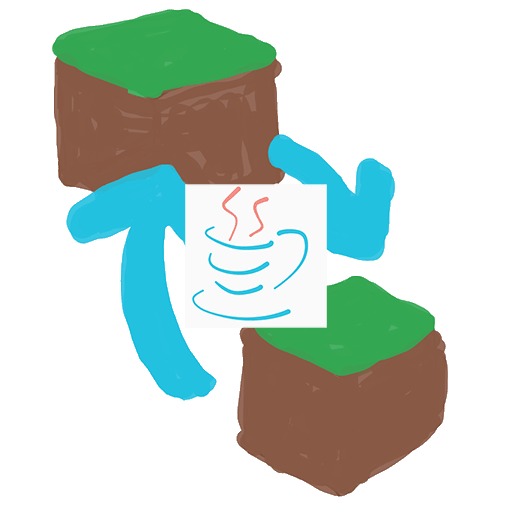

# MCModCheckerとは

[English README](./docs/img/README-en.md)

マインクラフトMODサーバーで役に立つ  
簡易MODチェッカーツールMCMC(MinecraftModChecker)です！  

modをサーバーと同期(手動)することが出来ます

## MCMCの使い方

### mcmc-checkモード

mcmc-checkモードはサーバーに参加するユーザーが利用します

1. マイクラの起動構成をmodsが作られる段階まで進めます
2. releaseからダウンロードしたファイルの中にある`mcmc.exe`を起動します
3. 後は画面に従って、変更があるMODのurlからダウンロードします

### mcmc-createモード

mcmc-createモードはサーバー管理者が利用します  
> [!NOTE]
> mcmcではGoogleスプレッドシートを利用してmodを管理します  
> mcmc-createでcsvを配布用jsonファイルに変換します  
> [配布用スプシ](https://docs.google.com/spreadsheets/d/1jK2O4XPjrdKb25UuNCZyihj8ZRA9owwC2hdli1RpFoc/edit?usp=sharing)

1. 配布用スプシを自分のドライブにコピーします
2. modとか色々の情報を入力します
3. スプシをcsvとして出力します
4. releaseからダウンロードしたファイルの中にある`mcmc-crate.bat`を起動します
5. 画面に従ってexportに出力されたjsonを、色々な方法[^1]でユーザーに配布します

[^1]: ユーザーにjsonファイルをダウンロードさせたり、GoogleDriveの直リンクで配布する方法とか色々
