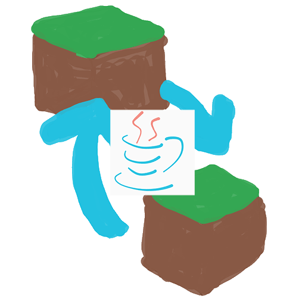

# What is MCModChecker

[日本語 README](../README.md)

Useful for Minecraft Mod Servers!  
MCMC (MinecraftModChecker) is a simple mod checker tool!  

You can sync (manually) mods with the server!

## How to use MCMC

### mcmc-check mode

mcmc-check mode is used by users joining the server

1. Advance the startup configuration of the Minecraft to the stage where mods are created
2. Start `mcmc.exe` in the file downloaded from release
3. After that, follow the screen and download from the url of the mod that has changes

### mcmc-create mode

mcmc-create mode is used by the server admin
> [!NOTE]
> mcmc uses Google Spreadsheets to manage mods  
> mcmc-create converts csv to json file for distribution  
> [mcmc Spreadsheets](https://docs.google.com/spreadsheets/d/1jK2O4XPjrdKb25UuNCZyihj8ZRA9owwC2hdli1RpFoc/edit?usp=sharing)

1. Copy the mcmc Spreadsheets to your my drive
2. Enter information about mods and stuff.
3. Output Spreadsheets as csv
4. Run `mcmc-crate.bat` in the file downloaded from release
5. Distribute the json output to the export according to the screen to users in various ways [^1]

[^1]: How to make users download json files, distribute via direct GoogleDrive link, etc.
